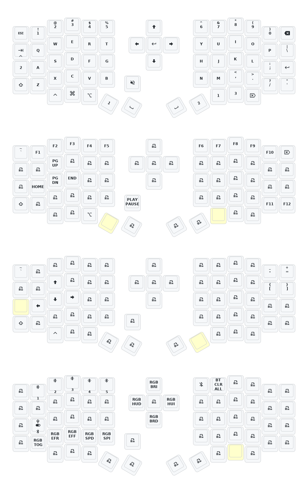

# Sofle Eyelash Split Keyboard with Encoder and Directional Switch (5-way joysticky)

#### A folk for the Split Sofle from Ali. Mainly to tweak the keymap and some behaviour to fit the daily driving purpose of writing documents.

**OCT 2025**

I decided to fork since the provider decided to include ZMK's experimental mousekey feature as well as soft-off combo key into the core functionality. This will break the `hold-tap` due to upstream, since combo timing needs to be a constant throughout the whole config. 
> Although you can fix the soft-off combo behavior to match the timing, the mousekey accerelation timing somehow still break `hold-tap`. Since ZMK documentation is quite obscure and I am a noob with embedded, I cannot fix this problem.

If you utilize tap-dance heavily and don't plan to use the mousekey feature, it is highly recommended that you grab the firmware from the Github Actions artifact from this repo instead.

